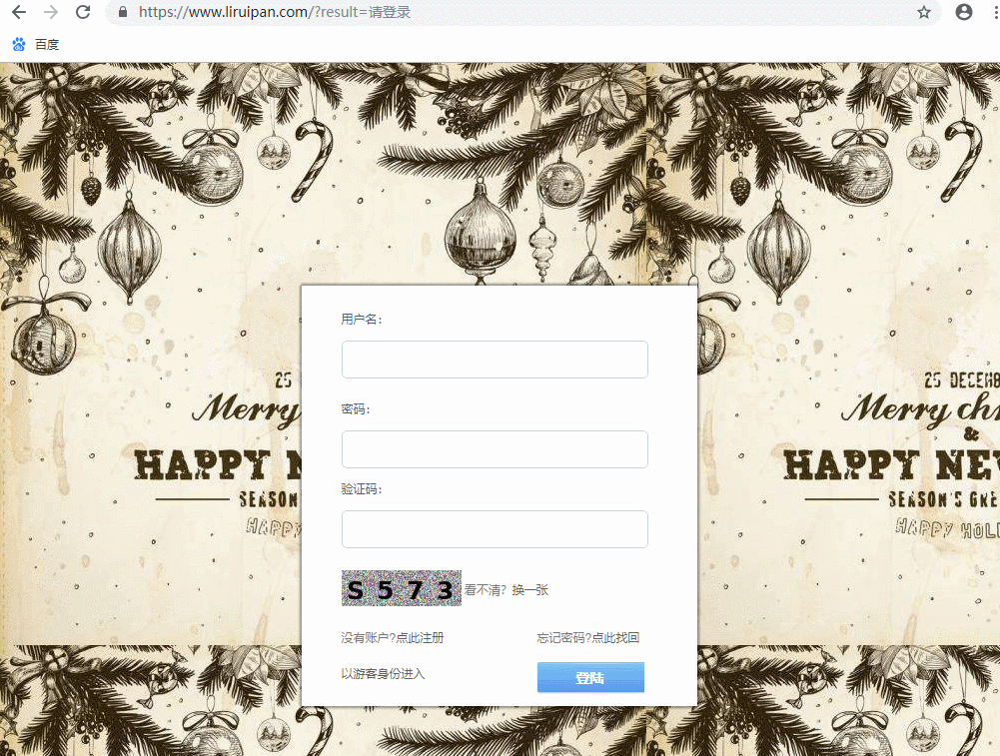
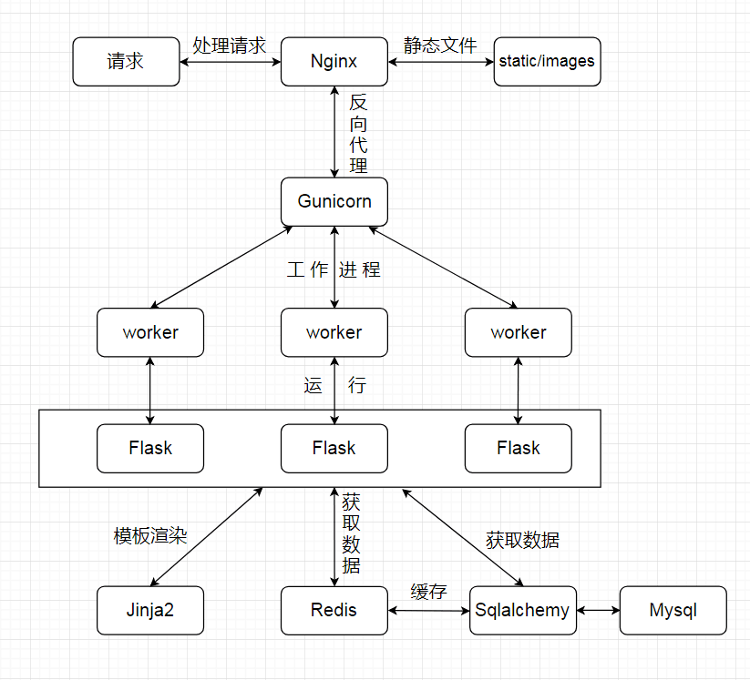

# Forum
**1 简介**

一个实用的论坛项目,基于Flask框架、Jinja模板、Sqlalchemy ORM框架、MySQL和Redis数据库。

**2 功能实现**

- 实现用户找回密码功能
- 实现用户注册、登陆、登出功能
- 实现用户个人主页展示相关动态功能
- 实现用户更改个人信息、密码、头像功能
- 实现查找用户、帖子功能
- 实现对帖子发表、删除评论功能
- 实现会话状态记录、权限判断功能
- 实现在对应版块发表、删除帖子功能
- 实现站内发出、回复、删除私信功能

**3 效果**

见该网站 https://www.liruipan.com

**4 部署架构图**

